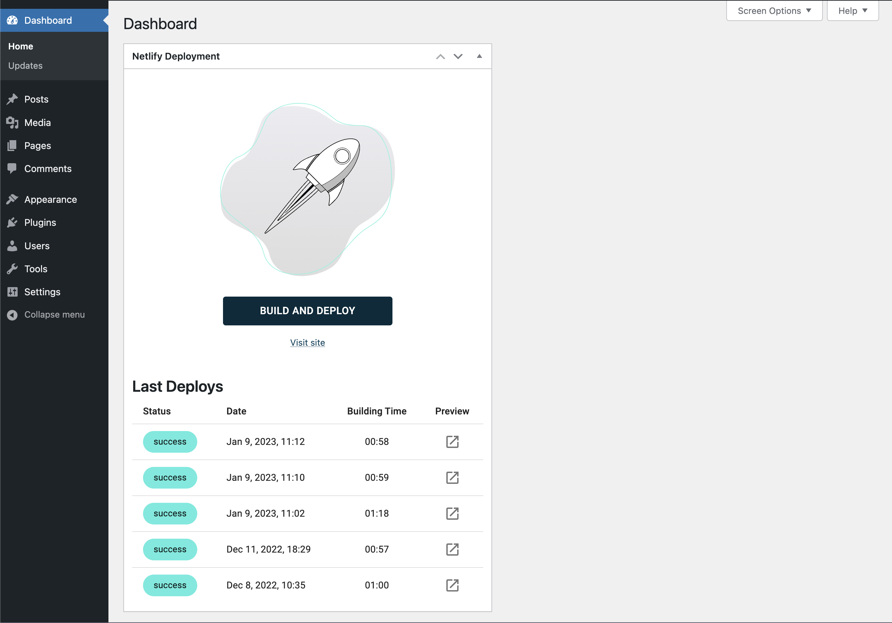

# Wordpress Dashboard Widget for Netlify

Dashboard widget that allows users to trigger and browse deployments on Netlify, when using Wordpress as headless CMS.

## Instalation

1. Upload the plugin folder `wordpress-netlify-deployment` to the `/wp-content/plugins` directory, or install the plugin through the WordPress plugins screen directly.
2. Activate the plugin through the 'Plugins' screen in WordPress
3. Go to plugin settings (Settings -> Deployment) and type your Netlify credentials
4. Go to Wordpress Dashboard to see you deployments or trigger the new one. Notice that the build has to bo finished in order to trigger the new one.

## Developing

If you want to change the plugin or add functionalities follow the following steps:

1. Navigate to plugin files `/wp-content/plugins/your-renamed-plugin-folder`, open terminal app.
2. Run the `npm install` command to install npm dependencies, wait sometimes to complete it.
3. Run `npm run start` command to initialize development of React JS, Development can be done any time. Use it in the development environment.
4. Run the `npm run build` command to finalize the development and be ready for production. The command creates production files. After building the production file move it to the production

## Changelog

### 1.0.0

- Initial Release

## License & Attribution

- GPLv2 or later © [Primož Weingerl](https://weingerl.com)
